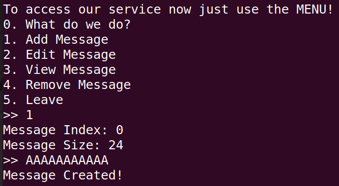

<h2>
    
HATEFUL2

</h2>

#### Description:-

You hate your Boss??? You wanna just trash talk him but you are afraid he would fire you???
Dont worry we got you! send us the message you want to send him and we will take care of everything for you!
try our new platform now! (the old one was sadly broken)

#### Challenge files:-

The challenge files consists of challenge binary,libc and ld file . The glibc version is 2.36 which is quite a recent version with a lot of security mitigation to protect against a number of  heap based corruptions but with tcache enabled. 

#### Recon :-

To begin with, Let's patch the challenge binary with the required libc version using pwninit.

And then run checksec against the binary to check for the security mitigations present.

Almost, every security mitigation are present in the binary. 

FULL RELRO :- No GOT overwrites to  redirect code execution

NX:- Memory mappings are either writable or executable but not both .

PIE:- Each time the binary loads into the process, the base address of the binary changes.

Stack canary:- A canary value is placed after the local variables in the stack frame before the saved frame pointer and the saved return address that checks whether the value is tampered before returning from the function and if the check fails, it kills the process to prevent from stack buffer overflows.

When running the binary it looks like a classical <i><b>heap note</b></i> challenge.

Let's do some basic dynamic analysis and explore each and every option except the "What do we do?" and "Leave" option as it looks pretty useless . 

1.Add message option :- This option allows us to create a chunk(malloc) with the choice of our size and index.

2.Edit message option :- This option allows us to edit the chunk contents of the chunk that has already been created.

3.View message option :- This option allows us to view the chunk contents of the chunk that has already been created.

4. Delete message option :- This options allows to delete(free) the chunk that was created using option 1.

   

 Now let's conduct a basic UAF dynamic check before loading the binary in ghidra.

After deleting the chunk, we can try to read the chunk contents and write the chunk contents. If we succeed in doing this,

then there is an UAF vulnerability present.

As, UAF is quite a easy bug to exploit with the current mitigation and the libc version.

From the above image, we can see that even after freeing the chunk 0 we can able to read the contents of the chunk(Read after free) useful for leaking the memory address of heap and libc and then edit the contents of the chunk(Write after free) used to tamper the linked list of the tcache free list.

But before exploiting the UAF vulnerability,let's go through some heap basics.

### Heap Basics

What is Heap?

The **heap** is a region of memory used for dynamic memory allocation during a program's execution. Unlike the **stack**, which is used for function calls and local variables, the heap allows for flexible memory management, meaning that memory can be allocated and freed at runtime.(Taken from chatgpt)

Memory is allocated using ``malloc()`` function and the memory is freed using ``free()`` function.

But how does the heap knows how to recycle the freed memory back to allocation again.??

It creates a single linked list and double linked list and assign the bin according to a lot of factors. 

#### Bins before Tcache origin:-

| Name        | Size                        | Type                     | Sorting |
| ----------- | --------------------------- | ------------------------ | ------- |
| Fastbins    | 0x20 - 0x80                 | Single Linked List(LIFO) | NA      |
| Unsortedbin | 0x90 - MMAP_THRESHOLD_SIZE  | Double Linked List(FIFO) | Before  |
| Smallbins   | 0x20-0x3f0                  | Double Linked List(FIFO) | After   |
| Largebins   | 0x400 - MMAP_THRESHOLD_SIZE | Double Linked List(FIFO) | After   |

 

#### Bins after tcache origin:-

| Name        | Size                                           | Type                     | Sorting |
| ----------- | ---------------------------------------------- | ------------------------ | ------- |
| Tcachebins  | 0x20 - 0x410(upto 7 freed chunks in each size) | Single Linked List(LIFO) | NA      |
| Fastbins    | 0x20 - 0x80                                    | Single Linked List(LIFO) | NA      |
| Unsortedbin | 0x90 - MMAP_THRESHOLD_SIZE                     | Double Linked List(FIFO) | Before  |
| Smallbins   | 0x20-0x3f0                                     | Double Linked List(FIFO) | After   |
| Largebins   | 0x400 - MMAP_THRESHOLD_SIZE                    | Double Linked List(FIFO) | After   |

### What happens when a chunk is freed?

#### Before Tcache:-

1. When a chunk from size 0x20 - 0x80 is freed,the chunk goes to their respective fastbin in main_arena.

   For an example:- In a test program, I allocated four chunks and freed all of them.

   Chunk A of size 32 bytes (24 bytes of data + 8 bytes of metadata)

   Chunk B of size 32 bytes (24 bytes of data + 8 bytes of metadata)

   Chunk C of size 48 bytes (24 bytes of data + 8 bytes of metadata) 

​	Chunk D of size  bytes (24 bytes of data + 8 bytes of metadata) 

##### Chunk Metadata:- 

The Metadata chunk is the quadword before the allocated chunk (Metadata chunk address = Return address of Malloc - 8 bytes). The chunk metadata consists of size of the chunk(every bit from the quadword except the LSB) and other important information. 

The last 3 bits hold the below information which heavily influences on how the chunk will be treated by the dynamic allocator :-

| Bit  | Information                                                  |
| ---- | ------------------------------------------------------------ |
| 001  | Previous chunk In-Use Bit                                    |
| 010  | Mmaped Chunk Bit(Chunk returned from mmap rather than malloc) |
| 100  | Non-Main arena Bit(Chunk allocated from non-main thread)     |

Let's see the examples with each program:-

##### Previous in chunk use bit:-

From the above image, we can see that the chunk metadata of the next chunk before freed has the last significant bit set 1. While after freeing the prev chunk,the next chunk after freeing the last significant bit is reset. 

##### Mmap chunk bit:-

From the above image, we can see that the malloc above the range of ``MMAP_THRESHOLD_BIT`` the memory is processed by the ``mmap`` function and then allocates a memory mapping instead of taking from the bins or from the top chunk. And the new region maps near the libc region instead of the range of heap region.

##### Non main arena bit:-

  

From the above image,we can see that we used a thread other than the main thread and allocated memory from both the threads. The allocation that came from the non main thread has the non main arena bit set. Because each thread has a separate arena and separate heap for its memory allocation and memory management. Even the address of each thread differs a lot. As they have different heap regions.

##### Fastbins:-

From the above image, we can see that there are two 0x20 sized chunks (Fastbins sized chunks).And one of them has an address in the first quadword while the other is null. And the same goes for the 0x30 chunks (Fastbins sized chunks again) as well. The answer for this  is ``Linked List`` . 

Fastbins works in LIFO (Last freed chunk gets allocated first) .The last freed ``chunk address - 0x10`` gets stored in the main arena fastbin area. If a chunk of the same size is already freed and the main arena fastbin area is not null. The value that is already present in the main arena gets replaced by the new chunk freed and the address that is present in the main arena gets placed in the chunk freed before.

``Main arena`` -> ``chunk 3`` ->``chunk 2``->``chunk 1``->NULL

So the process is like address in main arena points to the last freed chunk and the address in the last freed chunk points to the last before freed chunk and then the chain continues until it reaches the first freed chunk and that has the value null(signifying the end of chain).

When a new chunk(chunk 4) is freed then the single linked list looks like this:-

 ``Main arena`` -> ``chunk4`` ->``chunk 3`` ->``chunk 2``->``chunk 1``->NULL

But a peculiar thing with the fastbins is, the previous chunk in use bit is not reset when the previous chunk is freed . That's because the fastbins are smaller and fast chunks and there is no concept of consolidation(Will come back to it later). While the other bins are bit different,so they will have those bits reset.

##### Unsortedbin:-

Unsorted bin works in FIFO(First in First Out). And size of every chunk can be placed in the unsorted chunk but traditionally size more than 0x90. But in many cases of consolidation and last remainder, we even get chunks lesser than 0x90 being present in the unsorted bin. 

 Unsortedbin looks a bit different from the fact there are 2 quadwords of chunk containing the address and no NULL pointer present like the fastbins.

The answer is present simple - ``Double Linked List``

The first quadword in the freed chunk residing in unsorted bin points to the previous freed chunk in the unsorted bin and the second quadword in the freed chunk residing in unsorted bin points to the next freed chunk. The Main Arena holds the start and end of the unsorted bin double linked list. 

The Main arena unsorted bin first quadword points to the last freed chunk while the second quadword points to the first freed chunk.

Here you can see that in main_arena the value in address of 0x7ffff7b97b68 which is the unsorted bin prev points to the last freed chunk and 0x7ffff7b97b70 which is the unsorted bin next  points to the first freed chunk. Using multiple algorithms and last remainder chunk the chunk is allocated and sorted to smallbins and largebins according to the size. And the search for the best chunk for allocation starts from unsorted bin next pointer till it reaches the unsortedbin prev pointer.

##### How does malloc find suitable chunks for allocation?

When an memory allocation is triggered? The dynamic allocator first checks the size whether the requested exceeds MMAP_THRESHOLD_SIZE if yes,passes it to mmap. If not, it checks whether it is a fast bins sized chunk. If yes and also there is a freed chunk in the specific size bin it allocates the chunk from fast bins. If not, it searches the small bins but if size requirements is not met, next it searches through the unsorted bin and pass through the unsorted bin next and searches for best fit chunk(exact size match) and if the size is not perfect matches. It is sent to their specific small bins or large bins. And then if the last chunk in the unsorted bin has size more than the requested bin it takes a part of the chunk and then the rest becomes the last remainder chunk for the allocation and then returns the remainder size to the unsorted bin. If not, it sends it to the respected small bins or large bins .And then large bins if not again then finally it takes it from the top chunk.

``malloc``->``mmap?``->``fastbins?``->``smallbins?``->``unsortedbin?``->``last chunk in unsortedbin?``->``largebins?``->``Top chunk?``

##### What is sorting?

When malloc searches for a exact fit in the unsorted bin, it passes through the chunk from unsortedbin next pointer to go through the chain of chunks. 

If the perfect match is not found and the chunk is not a last remainder it is passed to the specific smallbin or largebin .This process of passing the chunk to the requested bin is called sorting.

##### Chunk Consolidation:-

When malloc frees a chunk that matches the size requirements of unsortedbin, and the chunk to be freed has its own previous in use bit reset. Then the neighbouring free chunks are consolidated into a single large unsorted chunk.

##### Fastbin Consolidation:-

Fastbin can also be consolidated into a single chunk in a specific condition when you have number of chunks in the fastbin and then you request a size more than the size cap of smallbins and fastbins. The fastbins that were present in the heap are consolidated into a number of unsorted bins.

##### Smallbins and Largebins:-

Small bins and Large bins also follow the double linked and works in the same manner as unsortedbin which is FIFO. But large bins has 2 double linked list which is four quadwords of data. The first two quadwords is the traditional prev and next address. The next two quadwords point to previous size pointer and next size pointer.

##### Top Chunk:-

It is the chunk which borders the top of an arena. While servicing 'malloc' requests, it is used as the last resort. If still more size is required, it can grow using the `sbrk` system call. The `PREV_INUSE` flag is always set for the top chunk.

#### After Tcache:-

TCache is a **per-thread memory cache** that stores recently freed small chunks (≤ 1032 bytes). Instead of accessing global bins or arenas, **each thread has its own cache**, making allocations **faster and lock-free**.

For each thread heap,There is an 0x290 chunk at the start of the heap which is the tcache administrator chunk(Not the official name. I like to call it that way).This 0x290 chunk consists of number of values in each chunk sizes and then the remaining part holds the address of the next chunk to be allocated when malloc request the specific size.

##### Tcachebins:-

The tcache bins works in the same way as fastbins which is single linked list and allocates chunk in LIFO manner. Tcachebins has size range upto 0x20 - 0x410 and holds upto 7 chunks. If the chunks freed more than seven it goes to fastbins or unsortedbin depending on the size.

##### Tcache 2.27 :-

Earlier version of tcache, the checks against double free or use after free. The first quadword consist of the next chunk to be in allocation cycle.

``|Metadata Chunk|Tcache fd|``

##### Tcache2 :-

Even though tcache chunk is singe linked it has two quadwords of address which is the first quadword consists of next chunk address and the second quadword consists of the address of tcache administrator check. During free, the second quadword is checked against the address of tcache administrator chunk if the value matches then it kills the program saying ``"Double free detected in tcache2"``. 

``|Metadata Chunk | Tcache fd | Tcache Address |``

##### Safe Linking:-

From glibc version 2.32,Checkpoint security research came up with a unique plan to secure the weak prone single linked list of Tcachebins and Fastbins by ``Xoring`` the Tcache next chunk address with the value of Current chunk address right shifted by 12 times.  Before poisoning the tcachebins and fastbins happens by just overwriting the fastbin or tcache fd pointer to the location they want to tamper by heap overflow or uaf or double free. But by safe linking, the attacker needs to leak the memory of the heap and also needs to know the location of the chunk they want to tamper.

``|Metadata Chunk|Tcache fd ^ (Chunk Location >> 12)|Tcache Address|``

Attacker forge their pointer by ``Xoring`` the address they want to tamper with the current chunk address right shifted by 12 times.

##### How malloc searches for chunks to allocate after tcache?:-

The same process but after the mmap checks ,it searches the tcachebins before going for the fastbins. The reason behind it is, it has to lock the arena again and again for bins other than tcachebins.

### Target for Heap exploitation (with full protections enabled on binary):

1. Hooks - Tampering the Malloc, Free, Calloc and Realloc hook pointer with system function address or one gadget address.(Hooks are removed from glibc 2.35 as there are target points for exploitation)

2. Libc internal .got -  Tampering the libc internal .got are harder to control with args and also super hard to find the perfect constraints for one gadget.

3. Exit hooks - Different from Malloc and free variants of hook .This works in every version. But a lot of tampering should be done.

4. Saved Return Address - Need to leak the stack address by the environ pointer in libc region and then overwriting the saved return address with rop to system or one gadget.

5. File Structure -  File structure exploitation, a bit tricky to exploit super hard to control, but works even when there is no way to get leaks. Overwrite widechar vtable or using it to gain arbitary write or arbitary read. 

   

## Back to Challenge:-

We know bit about basics, and now we turn back to our challenge binary again.

The glibc version is 2.36 that means the glibc version has safe linking present

#### Let's plan our attack :-

1. The challenge binary is compiled with almost every security mitigations present.
2. The binary has an UAF bug present that we found out from the dynamic analysis during the start of the analysis.
3. First of all, we leak the heap address by allocating and freeing tcache sized chunk and then using the view message option to read the heap leak which will be heap address right shifted by 12 times.
4. Then we proceed to leak the libc address by allocating and freeing a chunk that exceeds the ``TCACHE_MAX_SIZE`` which goes to the unsortedbin and then using the view message option to read the libc leak.
5. Using the UAF bug again and create 0x290 chunks and tamper the pointer to point to the ``tcache_perthread_struct + 0x10`` and then allocate and edit the same chunk again and allocate to leak the ``environ`` pointer.
6. Using the leaked stack address, Then edit the same ``tcache_perthread_struct`` chunk again and allocate to overwrite the return address with the ROP payload to get the shell.

#### Bypassing Safelinking:-

Allocate 2 chunks of size 0x290 using the add message option and then free one of them using the remove message option, and then view the contents using the view message option to get the heap leak from which we can bypass the safe linking mitigation.

#### Unsortedbin leaks :-

Allocate a single chunk of size 0x420 and then a guard chunk of size 0x18,using the add message option and then free one of them using the remove message option, and then view the contents using the view message option to get the libc leak from which we can use it as staging point to leak the environ pointer that holds the stack address.

#### Controlling the tcache_perthread_struct :-

Free the remaining 0x290 chunk using the remove message option and then overwrite the last freed chunk with the address of ``tcache_perthread_struct + 0x10``(16 bytes after the heap starts) and then control the whole tcache. Manipulating the tcache count as well as tcache entry variable to get arbitary write without the need of triggering the UAF vulnerability again and again.

#### More leaks and ROP:-

Overwrite the 0x20 size chunk count value with 0x1 and then the entry value with the address of ``environ - 0x10`` and then allocate the 0x20 size chunk with the add message option. And fill up to the environ pointer to leak the stack.

And then edit and allocate again to overwrite the saved return address with ROP payload and then use the leave option to return from main and execute the ROP Payload that calls the system function with the argument of ``/bin/sh`` 

You can find my exploit code here:- [Exploit](exploit.py)

#### Flag - ENO{W3_4R3_50RRY_4G41N_TH4T_TH3_M3554G3_W45_N0T_53NT_T0_TH3_R1GHT_3M41L}

